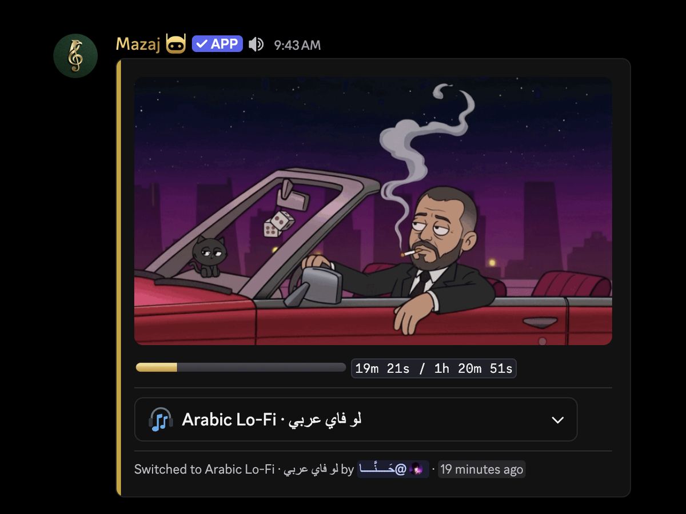
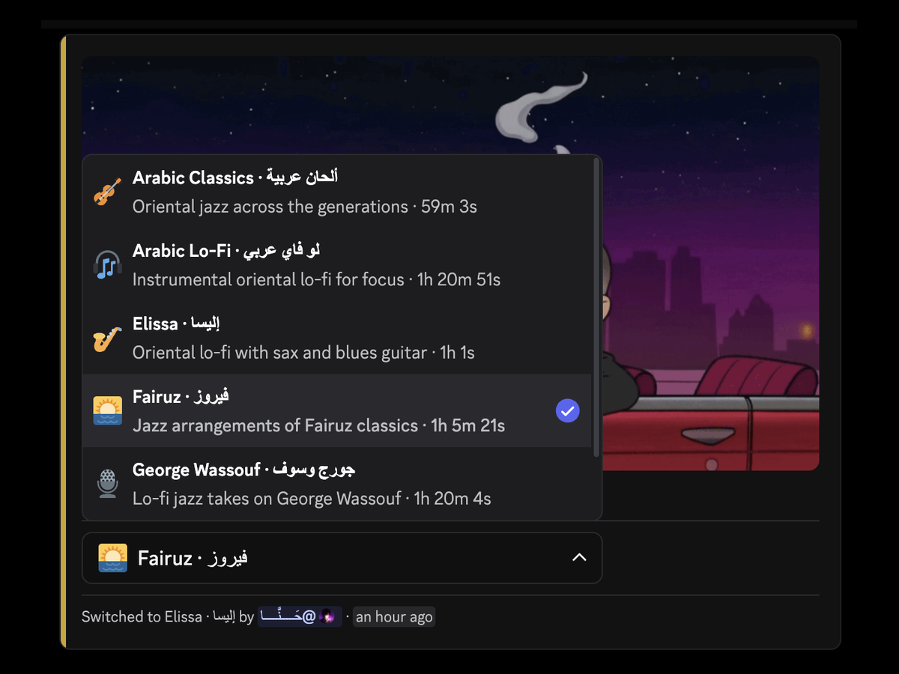
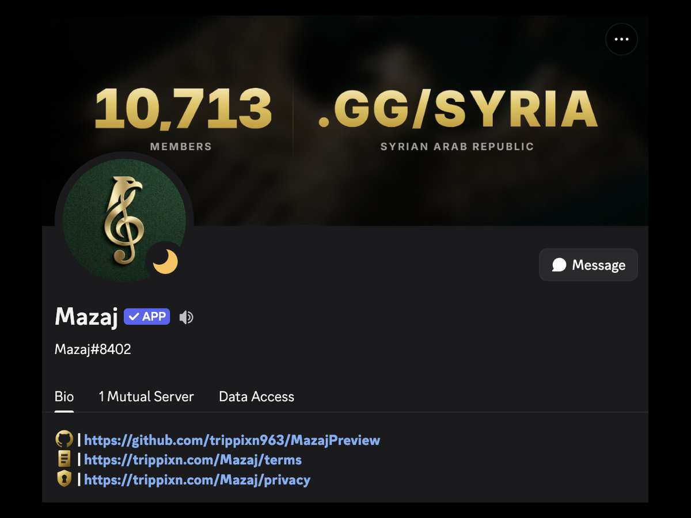
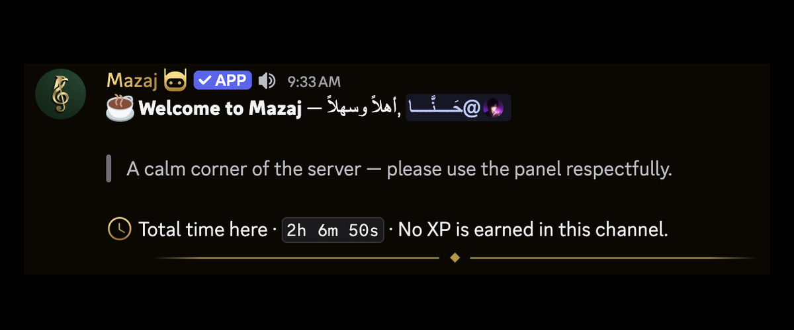
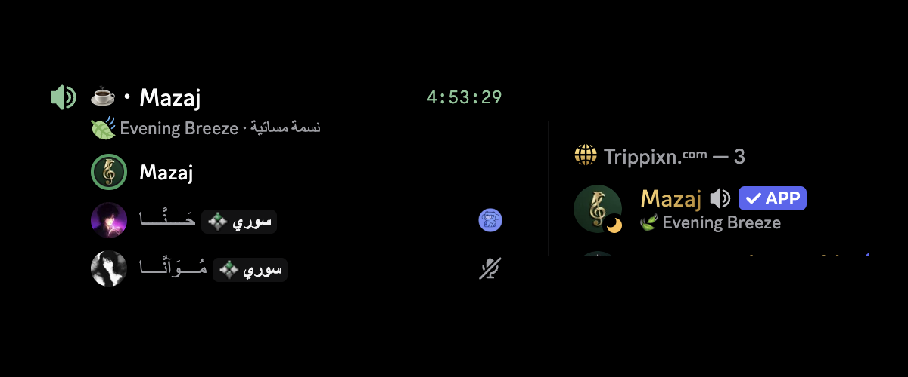

<div align="center">


# مزاج · Mazaj

**A 24/7 ambient Arabic lo-fi station, living in one Discord voice channel.**

Six hours of Fairuz, George Wassouf, Kadim Al Saher and Elissa, on a shuffle
that never stops — for a **10,700-member** community.


<p>

</p>

**[Live station page →](https://trippixn.com/Mazaj)**

</div>


<div align="center">

Mazaj is a private bot for [discord.gg/syria](https://discord.gg/syria). This is
a preview of what it does and how it's put together — the source, its
configuration and its audio library stay private.

**~8,600 lines Python** · **~6,100 lines TypeScript** · 22 modules · zero slash commands

</div>


<div align="center">

|  |  |  |
|:-:|:-:|:-:|
|  |  |  |
| **The panel** — gold progress bar, running timer, and the last person to change the track | **The library** — bilingual labels and real durations, one swap per person every ten minutes | **The profile** — banner mirrored from a live server-stats render shared with a sibling bot |

|  |  |
|:-:|:-:|
|  |  |
| **Arrivals** — mentioned on the way in, never on the way out. Self-deletes after ten minutes | **Status and presence** — sixteen bilingual mood lines, mirrored so the two can never drift |

</div>


##  &nbsp;How it works

```
                  ┌─────────────────────────┐
  Discord ◄──────►│        MazajBot         │
  Gateway         │                         │
                  │  Station                │──► Lavalink (JVM)
                  │   voice · deck · fader  │    decodes + encodes
                  │   supervisor sweep      │    out of process
                  │                         │
                  │  Services               │
                  │   panel · presence      │
                  │   greeter · tracker     │
                  │                         │
                  │  API :8092  ◄───────────┼──► nginx ──► trippixn.com/Mazaj
                  │   WebSocket, 5s push    │              React + Vite
                  └─────────────────────────┘
```

A supervisor sweeps every 30 seconds: probes the audio node, watches for a
stalled playhead, and detects dead air. State lives in small atomic JSON
sidecars — no database, because nothing here needs one.

**Minimum privilege.** No `message_content`, no `members` intent. The bot knows
somebody spoke; it cannot read a word of it.


##  &nbsp;The station page

`trippixn.com/Mazaj` renders live state from a WebSocket the bot serves on
loopback, proxied same-origin so the site's `connect-src 'self'` CSP is untouched.

One rule shapes it: **a page that blanks during an incident is worse than one
showing a stopped clock.** So the API never returns 5xx — a failure answers `200`
with the last good payload, `ok: false`, and an honest `generated_at`. Four
designed states read off that contract:

| | |
|:--|:--|
| **On air** | Amber, playhead advancing |
| **Last heard** | Values hold but drain amber → sage; the clock stops rather than being extrapolated |
| **Off air** | Bot down, API up — the dead-air timer becomes the loudest number on the panel |
| **No answer** | Every band and label stays; all values render as dashes |


<div align="center">

<picture><source media="(prefers-color-scheme: dark)" srcset="assets/mark-dark.png"></picture>

Built by **[Trippixn](https://trippixn.com)** &nbsp;·&nbsp; [discord.gg/syria](https://discord.gg/syria)


<sub>Mazaj is a private bot. This repository is a preview — the source, its configuration and its audio library are not published.</sub>

</div>
