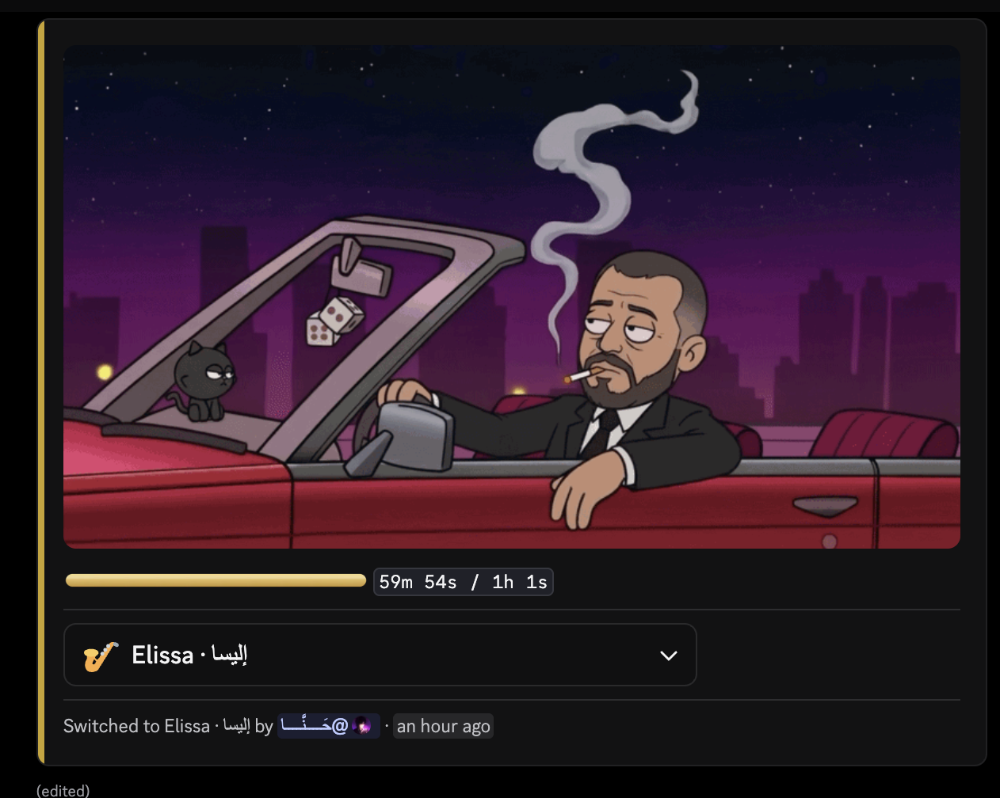
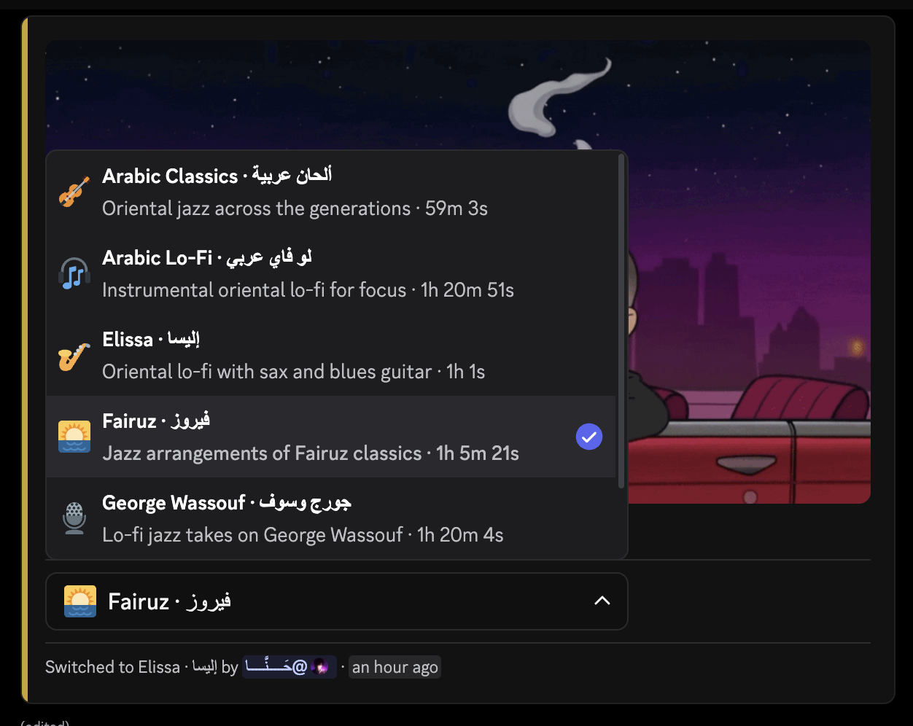
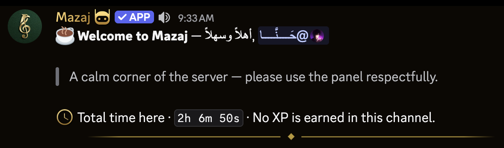
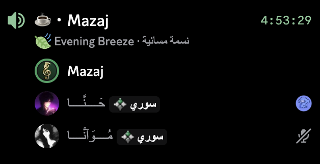
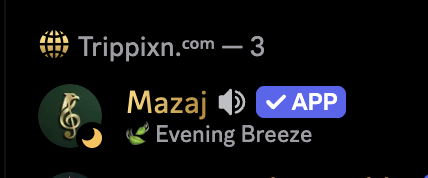
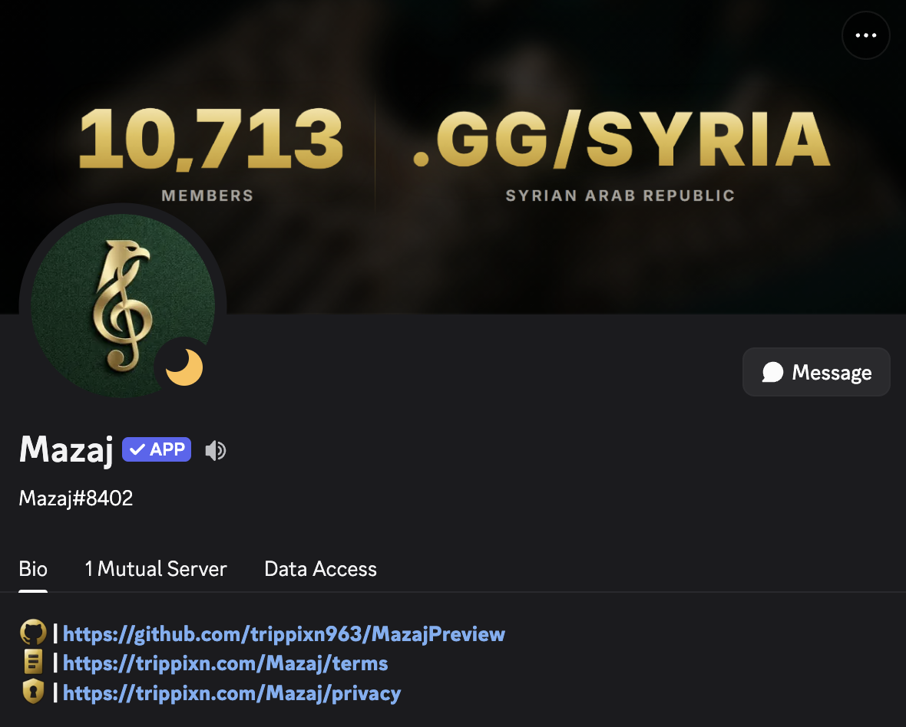

<div align="center">


# مزاج · Mazaj

**A 24/7 ambient Arabic lo-fi station, living in one Discord voice channel.**

Six hours of Fairuz, George Wassouf, Kadim Al Saher and Elissa, on a shuffle
that never stops — for a **10,700-member** community.


`Python 3.12` &nbsp;·&nbsp; `discord.py` &nbsp;·&nbsp; `Lavalink` &nbsp;·&nbsp; `WebSocket` &nbsp;·&nbsp; `React` &nbsp;·&nbsp; `TypeScript`

**[Live station page →](https://trippixn.com/Mazaj)**

</div>


<div align="center">

Mazaj is a private bot for [discord.gg/syria](https://discord.gg/syria). This is
a preview of how it's built — the source, its configuration and its audio stay
private. Every code excerpt below is verbatim from the running system.

| | |
|:--|:--|
| **Always on** | Resumes mid-track across restarts · rebuilds its own voice connection · self-restarts when its audio node dies unrecoverably |
| **Zero commands** | One dropdown. No slash surface to abuse, no permissions to audit |
| **Own frontend** | ~8,600 lines Python · ~6,100 lines TypeScript · 22 modules |
| **Out of process** | Lavalink does the decoding and Opus encoding — the bot never sits in the audio path |

</div>


##  &nbsp;The station

<div align="center">



</div>

A live Components V2 card: fixed art, a gold progress bar built from six custom
emoji, a running timer, and a footer crediting whoever last changed the track.
It refreshes every eight seconds and **re-posts itself below new messages**, so
it's always the last thing in the channel.

<div align="center">



</div>

Bilingual labels, real durations read off the loaded files. One swap per person
every ten minutes — a single dropdown changes what the whole room hears.


##  &nbsp;Presence

<div align="center">



</div>

Mentioned on the way in, never on the way out. Listening time accumulates across
restarts, and the figure is hidden entirely on a first visit — `0s` is a worse
greeting than none. Self-deletes after ten minutes.

<div align="center">


&nbsp;&nbsp;&nbsp;


</div>

Sixteen bilingual mood lines rotate on the channel status. The rich presence
**mirrors** whichever is showing rather than rotating on its own clock — two
timers would drift and display different moods at once. Idle, not online: the
moon is what a station sitting quietly looks like.


##  &nbsp;How it works

```
                  ┌─────────────────────────┐
  Discord ◄──────►│        MazajBot         │
  Gateway         │                         │
                  │  Station                │──► Lavalink (JVM)
                  │   voice · deck · fader  │    decodes + encodes
                  │   supervisor sweep      │    out of process
                  │                         │
                  │  Services               │
                  │   panel · presence      │
                  │   greeter · tracker     │
                  │                         │
                  │  API :8092  ◄───────────┼──► nginx ──► trippixn.com/Mazaj
                  │   WebSocket, 5s push    │              React + Vite
                  └─────────────────────────┘
```

A supervisor sweeps every 30 seconds: probes the audio node, watches for a
stalled playhead, and detects dead air. State lives in small atomic JSON
sidecars — no database, because nothing here needs one.

**Minimum privilege.** No `message_content`, no `members` intent. The bot knows
somebody spoke; it cannot read a word of it.


##  &nbsp;Two problems worth writing down

**The node lied about being alive.** wavelink exposes `node.status`. During a
real Lavalink outage it kept reporting `CONNECTED` long after the socket died —
so every recovery path built on it was a no-op, and the station sat silent while
claiming to be healthy. The fix was to stop asking and start probing:

```python
async def alive(self) -> bool:
    """Actively probe the node. The ONLY trustworthy liveness signal.

    Costs one cheap REST call. Worth it: the alternative is trusting a
    status field that has been observed lying for as long as the node
    stayed down.
    """
```

That result is **tri-state**, not boolean. `None` means *not yet probed* —
because the supervisor sleeps a full sweep before its first check, and a plain
`False` there meant the API reported a healthy station as stopped for the first
thirty seconds of every restart. Which is exactly the half-minute somebody
watching a recovery is looking at.

**A wait that never waited.** The panel follows chat, floored at six seconds so
a burst doesn't become a delete-and-repost per line. The floor worked; the sleep
did not:

```python
await asyncio.wait_for(self._activity.wait(), timeout=delay)
```

`asyncio.Event.wait()` on an already-set event returns **immediately**, and the
event was only cleared when a move actually happened. So during the floor —
exactly when the code believed it was throttling — the loop spun, editing the
panel at whatever rate the rate-limiter allowed. On an unresolvable channel it
spun with *no await at all*, blocking the entire event loop, audio included.

One event was doing two jobs:

```python
# Two separate things, deliberately. The Event is EDGE-triggered: it
# exists only to wake the tick early and is consumed once per pass.
# _pending_move is the LEVEL state that survives the sticky floor.
self._activity: asyncio.Event = asyncio.Event()
self._pending_move: bool = False
```

Measured after: **1 pass in 6 seconds**, down from thousands.


##  &nbsp;The station page

`trippixn.com/Mazaj` renders live state from a WebSocket the bot serves on
loopback, proxied same-origin so the site's `connect-src 'self'` CSP is untouched.

One rule shapes it: **a page that blanks during an incident is worse than one
showing a stopped clock.** So the API never returns 5xx — a failure answers `200`
with the last good payload, `ok: false`, and an honest `generated_at`. Four
designed states read off that contract:

| | |
|:--|:--|
| **On air** | Amber, playhead advancing |
| **Last heard** | Values hold but drain amber → sage; the clock stops rather than being extrapolated |
| **Off air** | Bot down, API up — the dead-air timer becomes the loudest number on the panel |
| **No answer** | Every band and label stays; all values render as dashes |

The playhead interpolates on the rail — a continuous quantity — and never
interpolates the clock, which is a sampled fact.


##  &nbsp;Design

<div align="center">



</div>

Every glyph is generated, not downloaded — rendered headless at 4× and
downsampled, on a six-stop gold ramp with a clipped inner bevel.

- **A ramp between two yellows has no light source in it.** That's why the first
  pass read as mustard: real gold needs a near-white specular and a deep bronze,
  on a diagonal.
- **The shadow must be warm.** A cool shadow under warm metal is the tell that
  makes a render look like a yellow sticker.
- **Detail is cut out, not drawn on.** Holes stay legible at 24px; painted-on
  detail is the first thing to vanish.
- **Fill the canvas.** Discord can't scale an emoji up, so internal padding is
  the only reason a glyph ever reads small — everything is cropped and re-padded
  to 92%.

The progress bar is six emoji with rounded end caps and a repeating middle, so
it reads as a bar rather than a row of blocks. It's deliberately *not* wrapped in
backticks: custom emoji don't render inside inline code, a detail that cost a
redesign to find.


<div align="center">

Built by **Trippixn** &nbsp;·&nbsp; [trippixn.com](https://trippixn.com) &nbsp;·&nbsp; [discord.gg/syria](https://discord.gg/syria)


<sub>Mazaj is a private bot. This repository is a preview — the source, its configuration and its audio library are not published.</sub>

</div>
